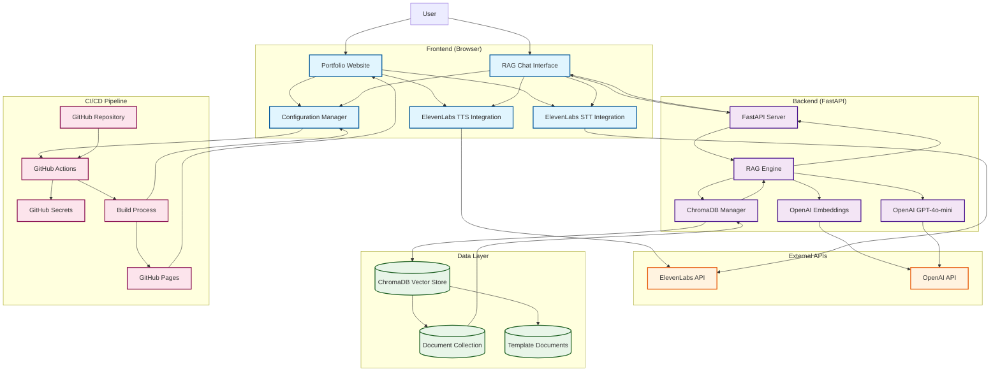

# System Architecture Diagram



## System Components

### Frontend Layer
- **Portfolio Website**: Main portfolio interface with AI features
- **ElevenLabs TTS**: Text-to-Speech for real-time voice responses
- **ElevenLabs STT**: Speech-to-Text for voice input
- **RAG Chat Interface**: AI conversation modal with portfolio knowledge
- **Configuration Manager**: Dynamic config loading from build process

### Backend Layer
- **FastAPI Server**: REST API endpoints and WebSocket handling
- **RAG Engine**: Retrieval-Augmented Generation pipeline
- **ChromaDB Manager**: Vector database operations
- **OpenAI Embeddings**: Text vectorization using `text-embedding-ada-002`
- **OpenAI LLM**: Language model using `gpt-4o-mini`

### External Services
- **ElevenLabs API**: Voice synthesis and recognition
- **OpenAI API**: Embeddings and language model generation

### Data Layer
- **ChromaDB Vector Store**: Local vector database
- **Document Collection**: Portfolio documents and CV
- **Template Documents**: Generic templates for open source users

### CI/CD Pipeline
- **GitHub Repository**: Source code and templates
- **GitHub Actions**: Automated build and deployment
- **GitHub Secrets**: Secure environment variable storage
- **Build Process**: Configuration injection and asset compilation
- **GitHub Pages**: Static site hosting

## Data Flow

1. **User Input**: Text or voice input through chat interface
2. **STT Processing**: Voice converted to text via ElevenLabs
3. **RAG Query**: Text sent to backend RAG system
4. **Vector Search**: Query embedded and similar documents retrieved
5. **LLM Generation**: Context + query sent to OpenAI for response
6. **TTS Output**: Response converted to speech via ElevenLabs
7. **Streaming**: Real-time audio streaming for natural conversation

## Build-Time Configuration

### Security Features
- **No hardcoded API keys** in repository
- **Environment variables** injected during build
- **GitHub Secrets** for sensitive configuration
- **Template-based approach** for open source users

### Configuration Injection
```yaml
# GitHub Actions injects these at build time
window.APP_CONFIG = {
  elevenLabsApiKey: '${{ secrets.ELEVENLABS_API_KEY }}',
  ragBackendUrl: '${{ secrets.RAG_BACKEND_URL }}',
  personalInfo: {
    name: '${{ secrets.PERSONAL_NAME }}',
    email: '${{ secrets.PERSONAL_EMAIL }}'
  }
}
```

## Key Features

- **Real-time TTS**: WebSocket-based streaming audio
- **Vector Search**: Semantic document retrieval
- **Context-Aware**: RAG system provides relevant background
- **Voice Interface**: Natural speech interaction
- **Local Storage**: ChromaDB for document vectors
- **Secure Deployment**: No secrets in repository
- **Template Ready**: Easy customization for other users

## Deployment Architecture

### Production (Your Portfolio)
- **GitHub Secrets** contain real API keys and personal info
- **Build process** injects real data into configuration
- **Deployed site** has full functionality with your information

### Template (Open Source Users)
- **Clean repository** with no personal information
- **Template files** for easy customization
- **GitHub Secrets** for their own configuration
- **Same functionality** with their data

This architecture ensures security, maintainability, and reusability while providing a professional portfolio with cutting-edge AI features.
